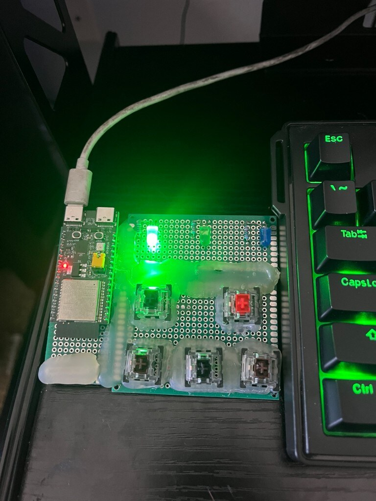
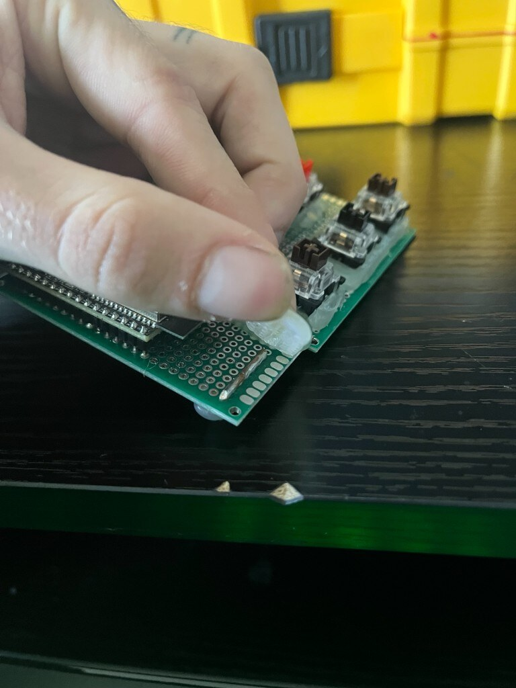
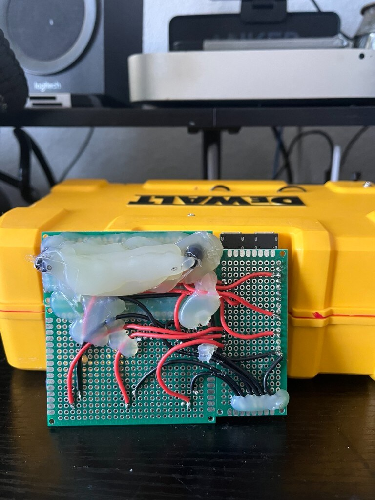
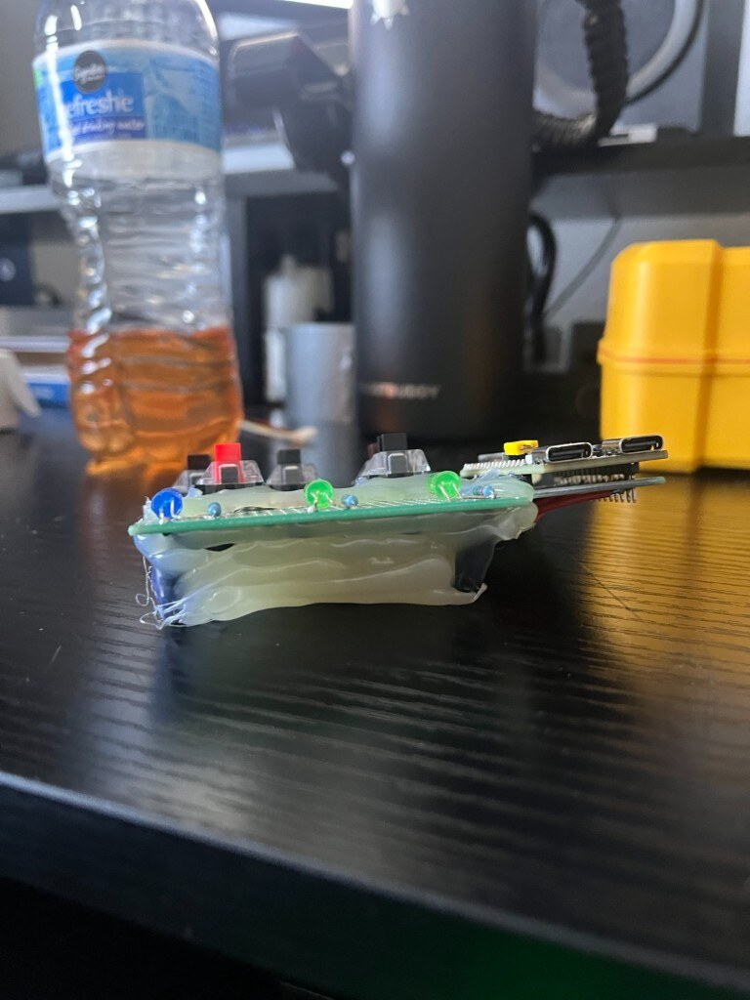
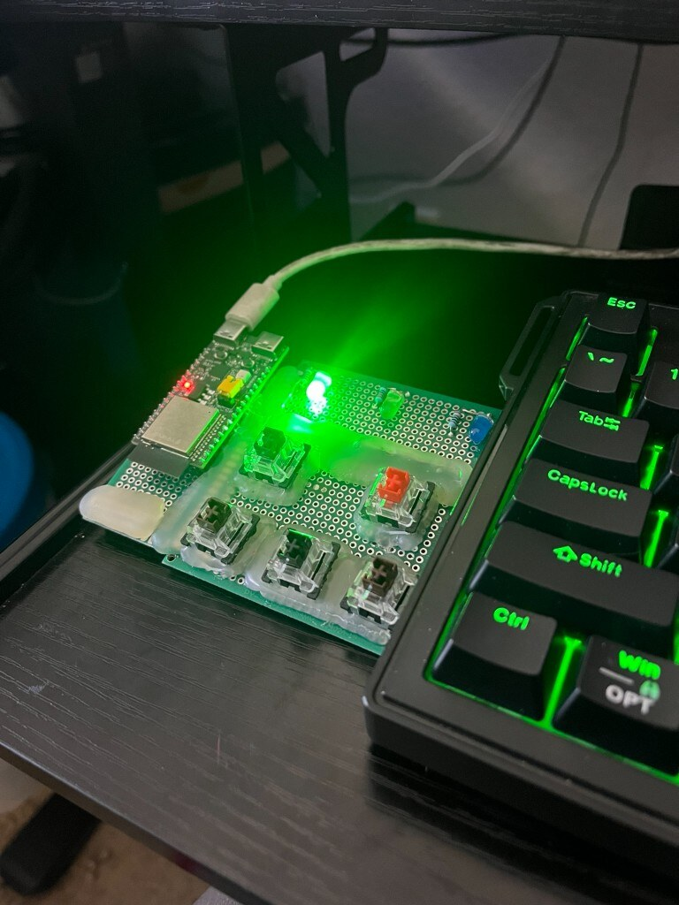
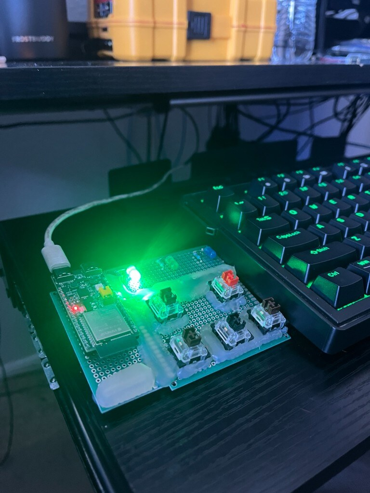

# Cyberpad V1 Hardware

## Origin

Cyberpad V1 was built in one day from parts already available rather than designed
around a custom PCB or enclosure. It is the physical controller for the
[HK Operator](../README.md) platform.

## Construction

Cyberpad V1 is literally an ESP32 development board and mechanical switches
mounted to perfboard, wired point-to-point, and held together with hot glue.

Explicit inventory:

- ESP32-C6 development board
- Generic perfboard
- Mechanical keyboard switches mounted directly to the perfboard
- Point-to-point wiring
- Solid copper / soldered common-ground bus
- Hot glue used for structural mounting
- Hot glue also used as an ergonomic hand-rest / chassis feature
- Three status LEDs
- No production enclosure
- No custom PCB

## Why it matters

Despite the crude construction:

- It was used daily for approximately four months
- It had no meaningful firmware failures during that validation period
- The physical layout became muscle memory
- The stable hardware interface justified building the HK Operator Mission
  Control Center (MCC)
- V1 acted as a real-world validation platform rather than a bench-only demo

## Ground bus

A solid common-ground bus serves the switch matrix. On perfboard it reduces
star-ground spaghetti, keeps returns short, and makes point-to-point wiring
easier to reason about when revising a one-day build.

The photo below is the **ground bar bus** — the soldered edge rail that ties
the switch grounds together. The hot glue is peeling because of how much the
pad has been used day-to-day (wear from handling and palm contact), not because
it was staged for the shot; that wear is what exposed the bus.

## Underside and hot-glue chassis

Point-to-point red/black wiring under the board, potted in places with hot glue:

Side profile — the thick hot-glue mass doubles as structural support / hand rest,
with the ground bus running through the glue line:

## Desk context

## Media index

| Shot | Path | Notes |
| --- | --- | --- |
| Top view | [`media/hardware/cyberpad-v1/top.jpg`](../media/hardware/cyberpad-v1/top.jpg) | Overhead with keyboard for scale |
| Underside wiring | [`media/hardware/cyberpad-v1/underside.jpg`](../media/hardware/cyberpad-v1/underside.jpg) | Point-to-point + glue potting |
| Copper / solder ground bus | [`media/hardware/cyberpad-v1/ground-bus.jpg`](../media/hardware/cyberpad-v1/ground-bus.jpg) | Ground bar bus; glue peeled from daily use |
| Hot-glue ergonomic support | [`media/hardware/cyberpad-v1/hot-glue-rest.jpg`](../media/hardware/cyberpad-v1/hot-glue-rest.jpg) | Side profile / glue chassis |
| Desk scale | [`media/hardware/cyberpad-v1/desk-scale.jpg`](../media/hardware/cyberpad-v1/desk-scale.jpg) | Lit green LED + keyboard |
| Top angled | [`media/hardware/cyberpad-v1/top-angled.jpg`](../media/hardware/cyberpad-v1/top-angled.jpg) | Alternate angle |
| Hand resting position | — | *(not yet)* |
| MCC controlling Cyberpad | — | *(not yet)* |

## Future hardware

Planned improvements (V1 is not being retired):

- Custom PCB
- Proper switch mounting
- Enclosure
- Strain relief
- Serviceability
- Preserving the validated physical layout that already has muscle memory

## Related

- [Architecture](./architecture.md)
- [Firmware](../firmware/README.md)
- [V1 hardware, summarized](./ESP-AND-HOT-GLUE.md)
