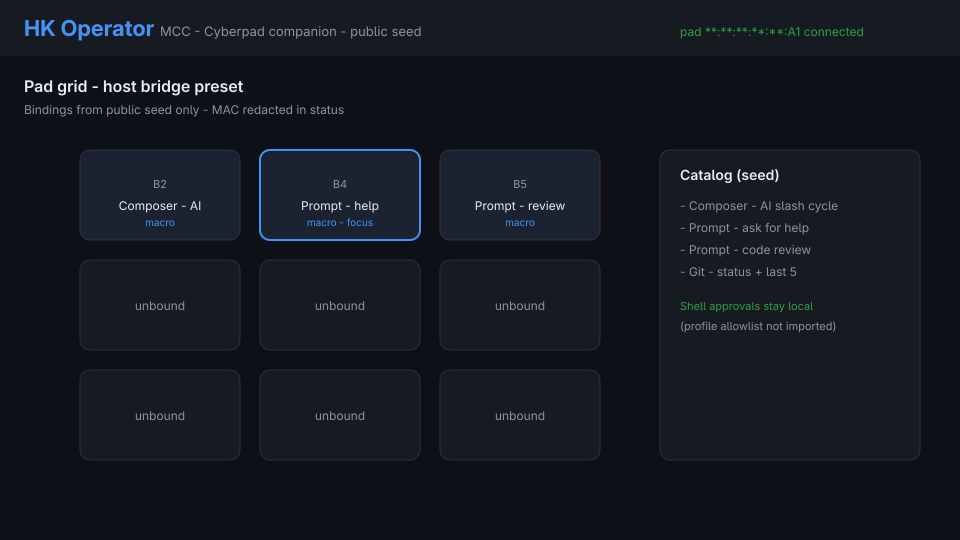

# Portfolio evidence — Cyberpad → MCC

Sanitized demonstration assets for the public HK Operator story.
Public seed / example labels only. No daily-driver store, no private remotes,
no absolute home paths, no full Bluetooth MACs.

## Story sequence

| Step | Asset | What it shows |
| --- | --- | --- |
| 1 | [`stills/01-cyberpad-desk.jpg`](./stills/01-cyberpad-desk.jpg) | Cyberpad V1 at desk scale (photo) |
| 1b | [`stills/01b-cyberpad-top.jpg`](./stills/01b-cyberpad-top.jpg) | Cyberpad V1 top view (photo) |
| 2 | [`stills/02-mcc-pad-grid.png`](./stills/02-mcc-pad-grid.png) | MCC pad grid with public seed bindings; MAC redacted in status |
| 3 | [`stills/03-press-to-toast.png`](./stills/03-press-to-toast.png) | Press → MacroEvent → binding → host toast |
| 4 | [`stills/04-composer-cycle.png`](./stills/04-composer-cycle.png) | Composer rotate/lock with `/help` `/review` `/plan` |
| 5 | [`stills/05-security-callout.png`](./stills/05-security-callout.png) | Phase 4 control summary (no secrets) |
| GIF | [`workflow.gif`](./workflow.gif) | Steps 2→3→4 loop (~3.6s) |

## Source frames

Editable SVG sources live in [`frames/`](./frames/). Raster PNGs and the GIF
are derived with `rsvg-convert` + ImageMagick.

Hardware stills are resized copies of
[`media/hardware/cyberpad-v1/`](../../media/hardware/cyberpad-v1/) (full-res
originals remain there).

## Honest scope

- MCC chrome frames are **illustrative mockups** matching public UI colors and
  public `seed.js` labels — not a live screen capture from a bonded session.
- Live HITL GIF (real pad press on camera + live MCC window) remains optional
  future evidence; redaction rules in
  [`../verification/harness.md`](../verification/harness.md) still apply.

## Hygiene

Before commit, confirm this directory has no:

- `/home/` absolute paths
- Bluetooth MAC pattern `XX:XX:XX:XX:XX:XX`
- Private git remotes or client URLs
- Live profile JSON / fire tokens

## Related

- [Architecture](../architecture.md)
- [Hardware V1](../hardware-v1.md)
- [Threat model](../security-threat-model.md)
- [MCC portfolio index](../../mcc/docs/PORTFOLIO.md)
- [Example profile](../../config/examples/dev.json)
